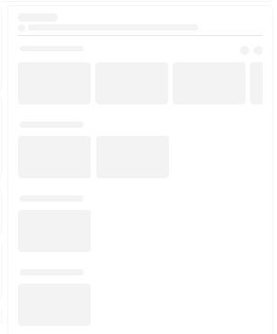
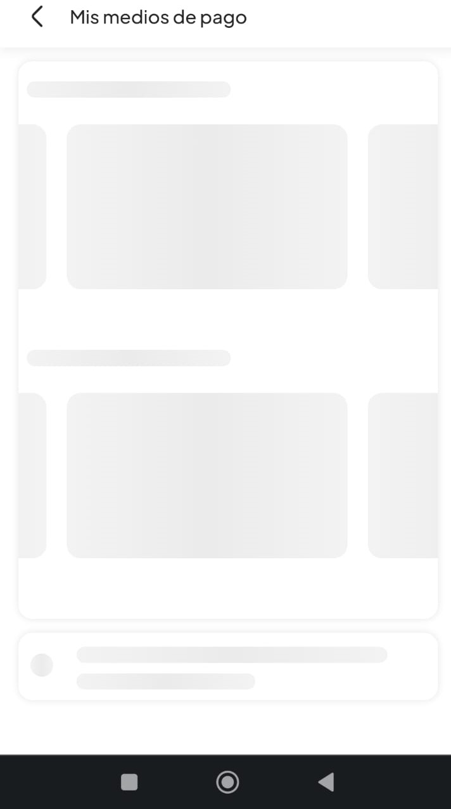
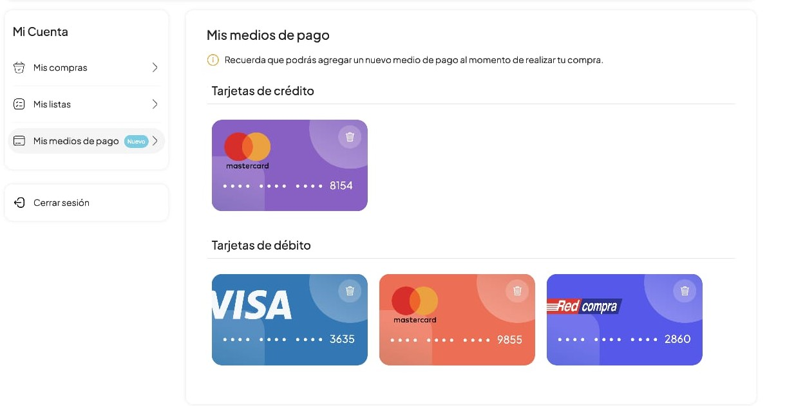
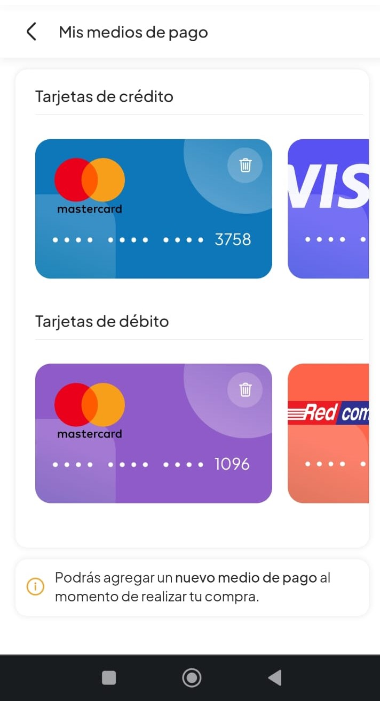
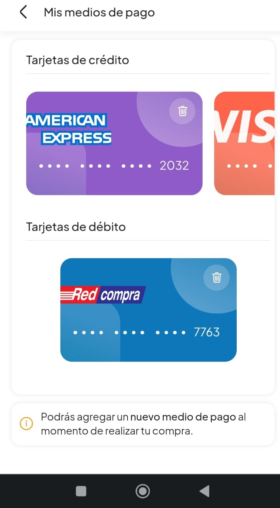
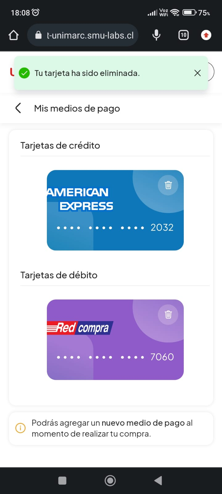

# Payment method

My means of payment arises from the need presented by users to be able to manage the cards stored on the site and have greater control over them, that is why from this module you can see the representation of all registered cards having the option to delete them.

## Below is a brief description of the workflow followed to create the 'My means of payment' experience:

- Creation of custom hook to consume get service to list the cards, and delete service to delete them.

- Creation and incorporation of a new module where 'My means of payment' will come to life.

- Hook consumption created to consume api get service.

- Creation of loading skeleton, both for the desktop version and for the mobile version.

- Creation of component which will render each of the cards registered by the user, each one with its specific characteristics, such as: color, design, logo, card number, icons.

- Creation of logic so that the list of cards becomes an infinite carousel in destock version, after having more than a specific amount of cards.

- Creation of slider to list the cards in mobile version.

- Creation of ui and logic in modal that gives access to the option to delete the selected card.

- Hook consumption created to consume delete service api.

- Creation of views to be used in case of an error in the api call, or in the event that the user does not yet have registered cards.

- Creation of a tooltip component to provide feedback to the user after removing their card.

## Here are some photos of the results obtained:

- Loaders: 

- List: 

- Modals: 

- Feedback: 

